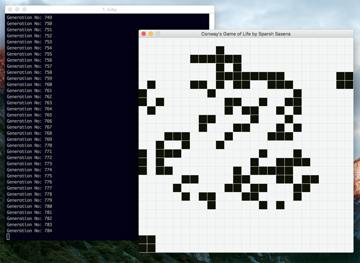

# Conway's Game of Life

The Game of Life is a [cellular automaton](https://en.wikipedia.org/wiki/Cellular_automaton) devised by the British mathematician John Horton Conway.

The Game of Life is played on a two-dimensional rectangular grid of cells. Each cell can be either alive or dead. The status of each cell changes each turn of the game - also called a generation - depending on the statuses of that cell's eight neighbors. 

You can find out more about the Game of Life watching this [awesome video](https://www.youtube.com/watch?v=CgOcEZinQ2I&feature=share&list=FLwikA_t8e6TSJW-L-lAHkKw) or reading this [Wikipedia entry](http://en.wikipedia.org/wiki/Conway%27s_Game_of_Life).

## Development

This is a simple implementation of Conway's Game of Life written in the Ruby programming language. It is a part of my apprenticeship at [8th Light, Inc](https://8thlight.com/). 

This project further caught my interest while reading the book [Understanding the Four Rules of Simple Design](https://leanpub.com/4rulesofsimpledesign) by Corey Haines. 



## Rules of the game:

The rules of the game are explained clearly in it's [Wikipedia entry](http://en.wikipedia.org/wiki/Conway%27s_Game_of_Life). The relevent portion is quoted here:

> The universe of the Game of Life is an infinite two-dimensional grid
> of square cells, each of which is in one of two possible states, alive or dead.
> Every cell interacts with its eight neighbours, which are the cells that are
> horizontally, vertically, or diagonally adjacent. **At each step in time, the
> following transitions occur:**
> 
> 1. Any live cell with fewer than two live neighbours dies, as if caused by under-population.
> 2. Any live cell with two or three live neighbours lives on to the next generation.
> 3. Any live cell with more than three live neighbours dies, as if by overcrowding.
> 4. Any dead cell with exactly three live neighbours becomes a live cell, as if by reproduction.

> The initial pattern is the first generation. The second generation evolves 
> from applying the rules simultaneously to every cell on the game board, i.e.
> births and deaths happen simultaneously. Afterwards, the rules are iteratively
> applied to create future generations.


## Installation & Usage

To get started you'll first want to install the `sdl2 library` if its not already installed on your computer:

```console
brew install sdl2
```


Then install the required Ruby gems which you can do easily using bundler:

```console
bundle install
```

Once the gems have been installed successfully, you can play the Game of Life by passing the game.rb file to the Ruby interpreter:

```console
ruby game.rb
```

## Tests

Tests are run on the command line using RSpec.

